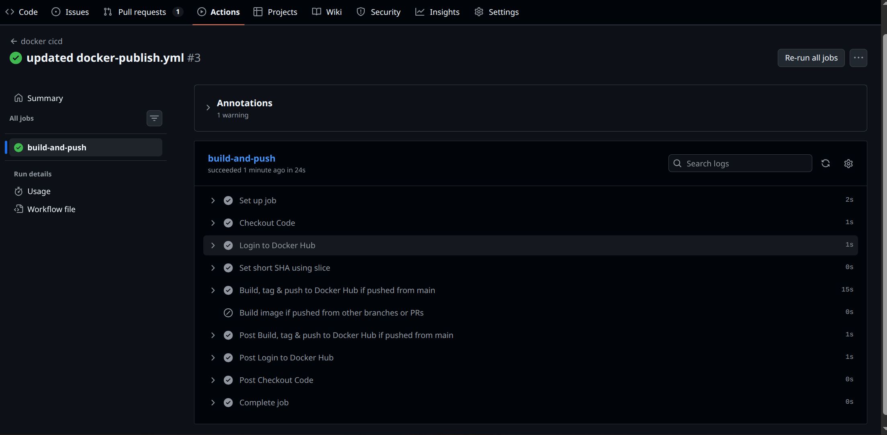
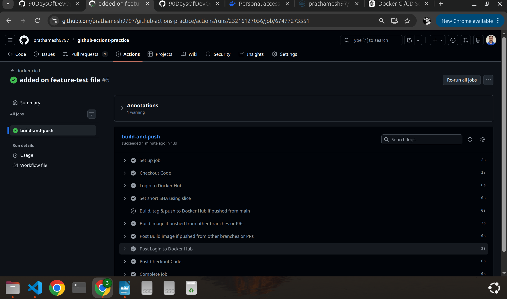
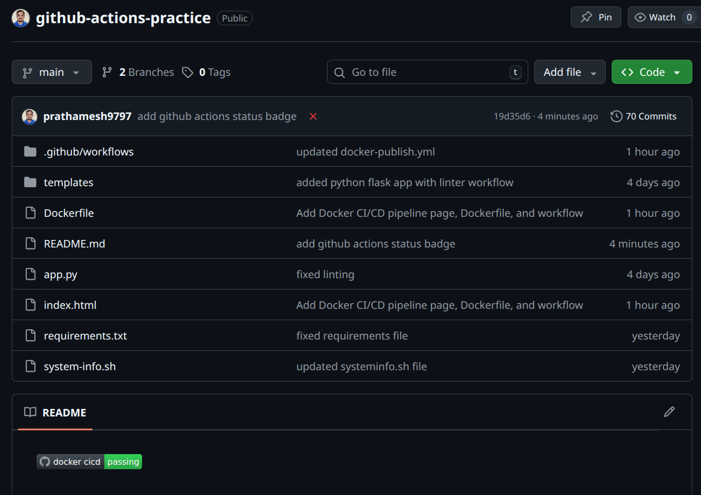
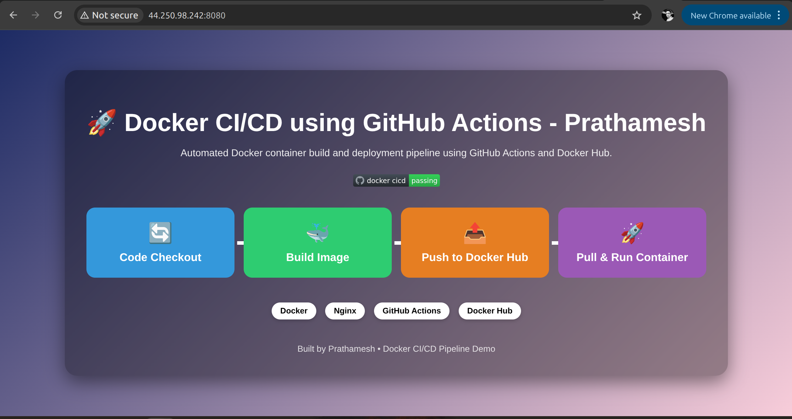

# Day 45 – Docker Build & Push in GitHub Actions
---
## Challenge Tasks

### Task 1: Prepare
1. Use the app you Dockerized on Day 36 (or any simple Dockerfile)
2. Add the Dockerfile to your `github-actions-practice` repo (or create a minimal one)
3. Make sure `DOCKER_USERNAME` and `DOCKER_TOKEN` secrets are set from Day 44

---

### Task 2: Build the Docker Image in CI
Create `.github/workflows/docker-publish.yml` that:
1. Triggers on push to `main`
2. Checks out the code
3. Builds the Docker image and tags it
**Verify:** Check the build step logs — does the image build successfully?
>> Yes , image built successfully,
   The GitHub Actions workflow completed and pushed the Docker image to Docker Hub

---

### Task 3: Push to Docker Hub
Add steps to:
1. Log in to Docker Hub using your secrets
2. Tag the image as `username/repo:latest` and also `username/repo:sha-<short-commit-hash>`
3. Push both tags

**Verify:** Go to Docker Hub — is your image there with both tags?

The GitHub Actions workflow logs in to Docker Hub using the repository
secrets DOCKER_USERNAME and DOCKER_TOKEN.

During the pipeline execution, the Docker image is built from the Dockerfile
and tagged with two tags:

    1. prathamesh97/webapp:latest
    2. prathamesh97/webapp:sha-b3c733d

Both tags are pushed to Docker Hub using the docker/build-push-action.

Verification: The Docker Hub repository (prathamesh97/webapp) shows both tags
(latest and sha-b3c733d), confirming that the image was successfully pushed.

---

### Task 4: Only Push on Main
Add a condition so the push step only runs on the `main` branch — not on feature branches or PRs.

Test it: push to a feature branch and verify the image is built but NOT pushed.

 1. Feature branch → build only
 2. Main branch → build + push to Docker Hub

 On the feature-test branch, the Docker image was built successfully but the push step was skipped because images are pushed only from the main branch.

---

### Task 5: Add a Status Badge
1. Get the badge URL for your `docker-publish` workflow from the Actions tab
2. Add it to your `README.md`
3. Push — the badge should show green

Create README.md in the repository root and add the GitHub Actions status badge so the workflow status (passing/failing) is visible in the repository.

---

### Task 6: Pull and Run It
1. On your local machine (or a cloud server), pull the image you just pushed
2. Run it
3. Confirm it works

The Docker image built by the CI pipeline was pulled from Docker Hub and run on both a local machine and an AWS EC2 server.

Commands used:

docker pull prathamesh97/webapp:latest
docker run -d -p 8080:80 prathamesh97/webapp:latest

The container successfully served the application at:

http://localhost:8080 (local machine)

http://EC2-PUBLIC-IP:8080 (AWS server)

>>Write in your notes: What is the full journey from `git push` to a running container?

Developer pushes code to GitHub

#git push origin main

GitHub triggers GitHub Actions workflow

CI pipeline runs:

Checkout repository

Login to Docker Hub

Build Docker image from Dockerfile

Image is tagged:

webapp:latest
webapp:sha-<commit>

Image is pushed to Docker Hub.

On a server or local machine:

docker pull username/webapp:latest

Container is started:

docker run -p 8080:80 username/webapp:latest

Application becomes accessible via browser.

---
