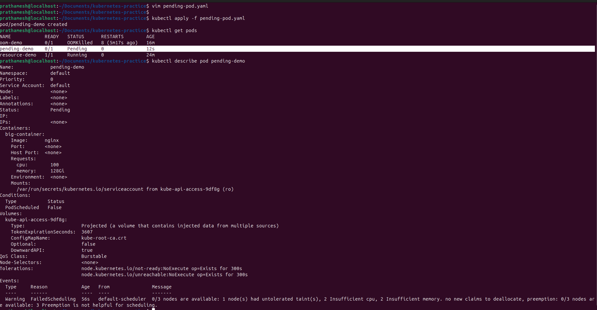

# Day 57 – Resource Requests, Limits, and Probes

## Task
Your Pods are running, but Kubernetes has no idea how much CPU or memory they need — and no way to tell if they are actually healthy. Today you set resource requests and limits for smart scheduling, then add probes so Kubernetes can detect and recover from failures automatically.

---

## Expected Output
- A Pod with CPU and memory requests and limits
- OOMKilled observed when exceeding memory limits
- Liveness, readiness, and startup probes tested

---

## Challenge Tasks

### Task 1: Resource Requests and Limits
1. Write a Pod manifest with `resources.requests` (cpu: 100m, memory: 128Mi) and `resources.limits` (cpu: 250m, memory: 256Mi)
2. Apply and inspect with `kubectl describe pod` — look for the Requests, Limits, and QoS Class sections
3. Since requests and limits differ, the QoS class is `Burstable`. If equal, it would be `Guaranteed`. If missing, `BestEffort`.

CPU is in millicores: `100m` = 0.1 CPU. Memory is in mebibytes: `128Mi`.

**Requests** = guaranteed minimum (scheduler uses this for placement). **Limits** = maximum allowed (kubelet enforces at runtime).

**Verify:** What QoS class does your Pod have?

- Pod have Qos Class `Burstable`

#### One-line Summary

- Requests decide scheduling, limits control usage, and QoS depends on how they’re defined.

---

### Task 2: OOMKilled — Exceeding Memory Limits
1. Write a Pod manifest using the `polinux/stress` image with a memory limit of `100Mi`
2. Set the stress command to allocate 200M of memory: `command: ["stress"] args: ["--vm", "1", "--vm-bytes", "200M", "--vm-hang", "1"]`
3. Apply and watch — the container gets killed immediately

CPU is throttled when over limit. Memory is killed — no mercy.

Check `kubectl describe pod` for `Reason: OOMKilled` and `Exit Code: 137` (128 + SIGKILL).

**Verify:** What exit code does an OOMKilled container have?
- An OOMKilled container exits with code 137
- Exceeding memory limits results in OOMKilled with exit code 137.
- Memory limits are strict. If exceeded → container is killed immediately.

### Observation

- Container exceeded memory limit (100Mi vs 200M requested)

- Kubernetes killed the container

### Result
- Reason: OOMKilled
- Exit Code: 137
- Pod Status: CrashLoopBackOff / restarting

### If you ever see:

Pods restarting randomly
Exit code 137

- First thing to check:

    - kubectl describe pod < pod-name >
    - This exact scenario is one of the most common debugging cases in Kubernetes.

---

### Task 3: Pending Pod — Requesting Too Much
This one teaches why a pod never starts at all.
Understand why a pod stays in Pending state.
1. Write a Pod manifest requesting `cpu: 100` and `memory: 128Gi`
2. Apply and check — STATUS stays `Pending` forever
3. Run `kubectl describe pod` and read the Events — the scheduler says exactly why: insufficient resources

**Verify:** What event message does the scheduler produce?
- 0/3 nodes are available: Insufficient cpu, Insufficient memory
- Scheduler ONLY looks at requests
- Limits don’t matter for scheduling
- If requested resources exceed cluster capacity, the pod stays Pending with scheduler error events.

### The scheduler is telling you ALL reasons, not just one.

- Even if:

    - CPU was enough
    - but memory wasn’t → still fails

- Even if:

    - Resources were enough
    - but taint exists → still fails
---

### Task 4: Liveness Probe
A liveness probe detects stuck containers. If it fails, Kubernetes restarts the container.

1. Write a Pod manifest with a busybox container that creates `/tmp/healthy` on startup, then deletes it after 30 seconds
2. Add a liveness probe using `exec` that runs `cat /tmp/healthy`, with `periodSeconds: 5` and `failureThreshold: 3`
3. After the file is deleted, 3 consecutive failures trigger a restart. Watch with `kubectl get pod -w`

**Verify:** How many times has the container restarted?
- 11 times container restarted (60s ago) → last restart happened 60 seconds ago

#### Readiness probes control traffic, not container lifecycle.

| Probe Type | Behavior              |
| ---------- | --------------------- |
| Liveness   | Restarts container 🔄 |
| Readiness  | Stops traffic 🚫      |

Container stays running
But removed from Service

---

### Task 5: Readiness Probe
A readiness probe controls traffic. Failure removes the Pod from Service endpoints but does NOT restart it.

1. Write a Pod manifest with nginx and a `readinessProbe` using `httpGet` on path `/` port `80`
2. Expose it as a Service: `kubectl expose pod <name> --port=80 --name=readiness-svc`
3. Check `kubectl get endpoints readiness-svc` — the Pod IP is listed
4. Break the probe: `kubectl exec <pod> -- rm /usr/share/nginx/html/index.html`
5. Wait 15 seconds — Pod shows `0/1` READY, endpoints are empty, but the container is NOT restarted

**Verify:** When readiness failed, was the container restarted?
   - No, the container was NOT restarted.

### Key Concept

- A readiness probe answers:

    - “Can this pod serve traffic right now?”

- If the answer is NO:

    - Pod is removed from Service endpoints 

###  Readiness probe failure marks the pod as not ready without restarting the container.
---

### Task 6: Startup Probe

- Prevent premature restarts

- Give apps enough time to start properly
    - “Wait until the app is fully started before checking liveness.”

A startup probe gives slow-starting containers extra time. While it runs, liveness and readiness probes are disabled.

1. Write a Pod manifest where the container takes 20 seconds to start (e.g., `sleep 20 && touch /tmp/started`)
2. Add a `startupProbe` checking for `/tmp/started` with `periodSeconds: 5` and `failureThreshold: 12` (60 second budget)
3. Add a `livenessProbe` that checks the same file — it only kicks in after startup succeeds

**Verify:** What would happen if `failureThreshold` were 2 instead of 12?

- If failureThreshold is set to 2,the startup probe allows only 10 seconds (2 × 5s) for the container to start.
- Since the container takes 20 seconds to start, the startupProbe will fail before the app is ready,causing Kubernetes to restart the container repeatedly.

`livenessProbe` is defined in the container spec but only becomes active after `startupProbe` succeeds.

#### 0/1 READY: app still starting (startupProbe running)

#### 1/1 READY: startup complete, livenessProbe active

---
## Kubernetes Probe Flow (Startup → Liveness → Readiness)

### Startup Probe

- “Give me time to start”

    - Runs first
    - Blocks others

### Liveness Probe

- “Am I alive?”

    - Fails → 🔄 restart

### Readiness Probe

- “Can I serve traffic?”

    - Fails → 🚫 no traffic

---

## Documentation

### Requests vs limits (scheduling vs enforcement)
- Requests (Scheduling)
    - Define the minimum resources a container needs
    -  Used by the scheduler to place the Pod on a node
    - Guarantees availability of CPU/memory
- Limits (Enforcement)
    - Define the maximum resources a container can use
    - Enforced by the kubelet at runtime

| Feature   | Requests   | Limits          |
| --------- | ---------- | --------------- |
| Purpose   | Scheduling | Runtime control |
| Used by   | Scheduler  | Kubelet         |
| Guarantee | Minimum    | Maximum         |

### What happens when CPU or memory limits are exceeded

- CPU Limit Exceeded
    - CPU is throttled
    - Container continues running (slower)

    - No crash occurs

- Memory Limit Exceeded
    - Container is killed immediately
    - Reason: OOMKilled
    - Exit Code: 137

    - Pod may restart (CrashLoopBackOff)

### Liveness vs readiness vs startup probes

| Probe Type       | Purpose                         | When it Runs                 | If it Fails                          | Simple Meaning              |
|------------------|---------------------------------|------------------------------|--------------------------------------|-----------------------------|
| Startup Probe    | Check if app has started        | At container startup         | Container is restarted               | "Has app started?"          |
| Liveness Probe   | Check if app is still alive     | After startup succeeds       | Container is restarted               | "Is app alive?"             |
| Readiness Probe  | Check if app can serve traffic  | Throughout lifecycle         | Removed from service (no traffic)    | "Is app ready for users?"   |

---

## Hints
- CPU is compressible (throttled); memory is incompressible (OOMKilled)
- CPU: `1` = 1 core = `1000m`. Memory: `Mi` (mebibytes), `Gi` (gibibytes)
- QoS: Guaranteed (requests == limits), Burstable (requests < limits), BestEffort (none set)
- Probe types: `httpGet`, `exec`, `tcpSocket`
- Liveness failure = restart. Readiness failure = remove from endpoints. Startup failure = kill.
- `initialDelaySeconds`, `periodSeconds`, `failureThreshold` control probe timing
- Exit code 137 = OOMKilled (128 + SIGKILL)